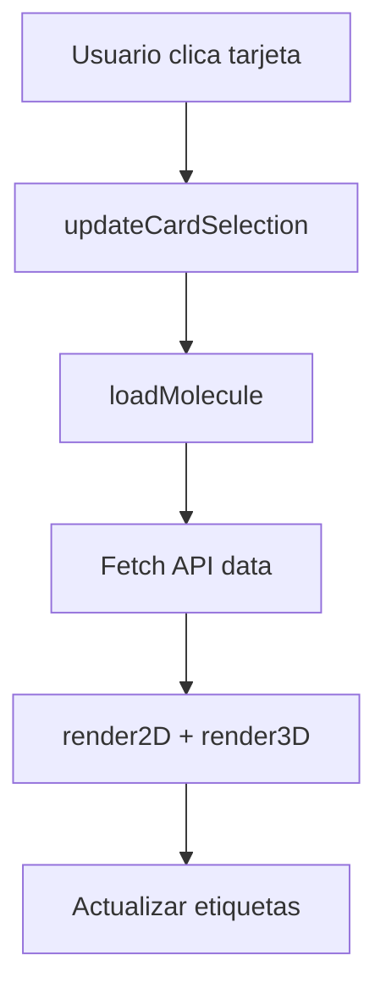
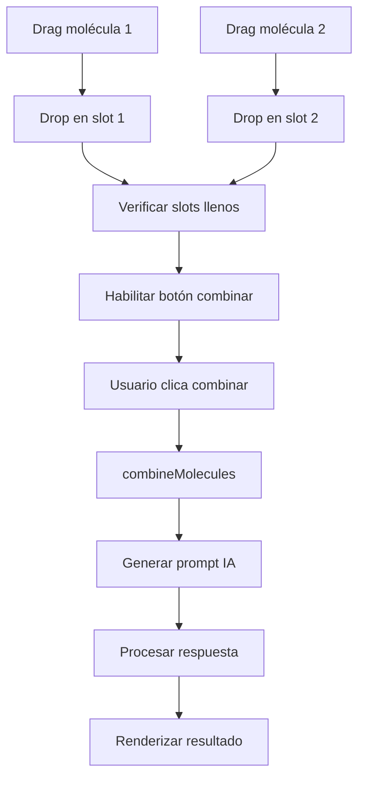
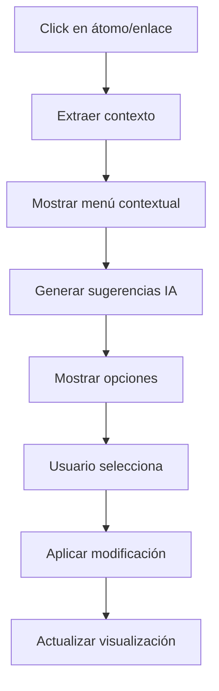

# Guía de Componentes - Quimática Orgánica

## Descripción General

Esta documentación describe todos los componentes de interfaz de usuario, sus propiedades, métodos y patrones de interacción en la aplicación Quimática - Orgánica.

## Arquitectura de Componentes

La aplicación utiliza una arquitectura modular basada en:
- **HTML semántico** para la estructura
- **CSS con metodología BEM** para estilos
- **JavaScript ES6 modules** para funcionalidad
- **Event-driven architecture** para comunicación entre componentes

---

## Componentes Principales

### 1. Banco de Moléculas (`#molecule-bank`)

#### Descripción
Contenedor principal que muestra las moléculas disponibles para visualización y combinación.

#### Estructura HTML
```html
<div id="molecule-bank" class="top-section">
    <h3>Banco de Moléculas</h3>
    <p>Haz clic para ver, o arrastra para combinar.</p>
    <div class="molecule-card-container">
        <div class="molecule-card" id="card-estradiol" data-molecule-name="estradiol" draggable="true">
            <lord-icon src="..." trigger="loop" state="loop-snake-alt"></lord-icon>
        </div>
        <!-- Más tarjetas... -->
    </div>
</div>
```

#### Propiedades CSS
```css
.molecule-card {
    width: 120px;
    height: 120px;
    background: linear-gradient(135deg, #667eea 0%, #764ba2 100%);
    border-radius: 15px;
    display: flex;
    align-items: center;
    justify-content: center;
    cursor: pointer;
    transition: all 0.3s ease;
    position: relative;
    overflow: hidden;
}

.molecule-card.selected {
    transform: scale(1.05);
    box-shadow: 0 8px 25px rgba(102, 126, 234, 0.4);
    border: 2px solid #667eea;
}

.molecule-card.dragging {
    opacity: 0.7;
    transform: rotate(5deg);
}
```

#### Funcionalidades

##### Selección de Molécula
```javascript
// Event listener para selección
card.addEventListener('click', () => {
    const moleculeName = card.dataset.moleculeName;
    currentSelectedMolecule = moleculeName;
    updateCardSelection(moleculeName);
    loadMolecule(moleculeName);
});
```

##### Drag & Drop
```javascript
// Configuración de arrastre
card.addEventListener('dragstart', (event) => {
    event.dataTransfer.setData('text/plain', card.dataset.moleculeName);
    event.dataTransfer.effectAllowed = 'copy';
    card.classList.add('dragging');
});

card.addEventListener('dragend', () => {
    card.classList.remove('dragging');
});
```

#### Estados Visuales

| Estado | Clase CSS | Descripción |
|--------|-----------|-------------|
| Normal | `.molecule-card` | Estado por defecto |
| Seleccionado | `.molecule-card.selected` | Molécula actualmente visualizada |
| Arrastrando | `.molecule-card.dragging` | Durante operación drag |
| Hover | `.molecule-card:hover` | Al pasar el mouse |

#### Métodos Asociados

##### `populateMoleculeCards()`
Inicializa las tarjetas con íconos animados y eventos.

##### `updateCardSelection(moleculeName)`
Actualiza la selección visual de las tarjetas.

---

### 2. Zona de Combinación (`#combination-section`)

#### Descripción
Área interactiva donde los usuarios pueden combinar moléculas usando IA.

#### Estructura HTML
```html
<div class="top-section" id="combination-section">
    <h3>Zona de Combinación</h3>
    <p>Arrastra las moléculas aquí.</p>
    <div id="combination-drop-zone">
        <div id="mol-slot-1" class="mol-slot">
            <p>Molécula 1</p>
        </div>
        <div id="mol-slot-2" class="mol-slot">
            <p>Molécula 2</p>
        </div>
    </div>
    <div class="combination-controls">
        <select id="model-select">
            <option value="gemini-1.5-flash">Gemini 1.5 Flash</option>
            <!-- Más opciones... -->
        </select>
        <button id="clear-combination-btn" class="control-btn" disabled>
            <span class="btn-text carrusel-text">Limpiar Combinación</span>
        </button>
    </div>
</div>
```

#### Propiedades CSS
```css
.mol-slot {
    width: 150px;
    height: 100px;
    border: 2px dashed #ccc;
    border-radius: 10px;
    display: flex;
    align-items: center;
    justify-content: center;
    margin: 10px;
    transition: all 0.3s ease;
    background: rgba(255, 255, 255, 0.1);
}

.mol-slot.drag-over {
    border-color: #667eea;
    background: rgba(102, 126, 234, 0.1);
    transform: scale(1.05);
}

.mol-slot.filled {
    border-color: #4CAF50;
    background: rgba(76, 175, 80, 0.1);
}
```

#### Funcionalidades

##### Drop Zone Configuration
```javascript
function setupDragAndDrop() {
    const slots = document.querySelectorAll('.mol-slot');
    
    slots.forEach(slot => {
        slot.addEventListener('dragover', (e) => {
            e.preventDefault();
            slot.classList.add('drag-over');
        });
        
        slot.addEventListener('drop', (e) => {
            e.preventDefault();
            const moleculeName = e.dataTransfer.getData('text/plain');
            fillSlot(slot, moleculeName);
            slot.classList.remove('drag-over');
        });
        
        slot.addEventListener('dragleave', () => {
            slot.classList.remove('drag-over');
        });
    });
}
```

##### Selector de Modelo IA
```javascript
// Configuración de modelos disponibles
const models = [
    { value: 'gemini-1.5-flash', name: 'Gemini 1.5 Flash', speed: 'Rápido' },
    { value: 'gemini-1.5-pro', name: 'Gemini 1.5 Pro', speed: 'Potente' },
    { value: 'gemini-2.5-flash-lite', name: 'Gemini 2.5 Flash Lite', speed: 'Ultrarrápido' },
    { value: 'gemini-2.5-pro', name: 'Gemini 2.5 Pro', speed: 'Máximo rendimiento' }
];
```

#### Estados de Botón

| Estado | Texto | Loading | Disabled | Función |
|--------|-------|---------|----------|---------|
| Inicial | "Limpiar Combinación" | false | true | N/A |
| Listo | "Combinar Moléculas" | false | false | `combineMolecules()` |
| Procesando | "Combinando..." | true | true | N/A |
| Completado | "Limpiar Combinación" | false | false | `clearCombination()` |

---

### 3. Visor 2D (`#viewer-container-2d`)

#### Descripción
Componente para visualización bidimensional de estructuras moleculares usando SVG.

#### Estructura HTML
```html
<div class="viewer-section" id="viewer-container-2d">
    <h3>Vista 2D: <span id="molecule-name-2d" class="carrusel-text"></span></h3>
    <div class="controls-2d">
        <label>
            <input type="checkbox" id="show-atom-indices" checked> 
            Índices de Átomos
        </label>
        <label>
            <input type="checkbox" id="show-bond-indices" checked> 
            Índices de Enlaces
        </label>
    </div>
    <div id="viewer-2d"></div>
    <div class="viewer-loader-overlay" style="display: none;">
        <!-- Loader dinámico -->
    </div>
</div>
```

#### Propiedades CSS
```css
#viewer-2d {
    width: 100%;
    height: 400px;
    border: 1px solid #ddd;
    border-radius: 8px;
    background: white;
    display: flex;
    align-items: center;
    justify-content: center;
    position: relative;
    overflow: hidden;
}

.viewer-loader-overlay {
    position: absolute;
    top: 0;
    left: 0;
    right: 0;
    bottom: 0;
    background: rgba(255, 255, 255, 0.9);
    display: flex;
    align-items: center;
    justify-content: center;
    z-index: 10;
}
```

#### Funcionalidades

##### Renderizado SVG
```javascript
function render2D(svgContent) {
    const viewer2D = document.getElementById('viewer-2d');
    viewer2D.innerHTML = svgContent;
    
    // Configurar pan & zoom
    const svgElement = viewer2D.querySelector('svg');
    if (svgElement) {
        svgPanZoom(svgElement, {
            zoomEnabled: true,
            controlIconsEnabled: true,
            fit: true,
            center: true
        });
    }
}
```

##### Controles de Visualización
```javascript
// Event listeners para controles 2D
document.getElementById('show-atom-indices').addEventListener('change', rerenderCurrentMolecule);
document.getElementById('show-bond-indices').addEventListener('change', rerenderCurrentMolecule);

function rerenderCurrentMolecule() {
    if (currentMolecule) {
        const showAtoms = document.getElementById('show-atom-indices').checked;
        const showBonds = document.getElementById('show-bond-indices').checked;
        
        // Re-fetch con nuevos parámetros
        fetchMoleculeData(currentMolecule, showAtoms, showBonds)
            .then(data => render2D(data.svg));
    }
}
```

#### Características Avanzadas

##### Pan & Zoom Interactivo
- **Biblioteca**: svg-pan-zoom
- **Controles**: Mouse wheel (zoom), drag (pan)
- **Botones**: Zoom in/out, reset, fit to screen

##### Información de Enlaces
```javascript
// Extracción de datos de enlaces del SVG
function extractBondInfo(bondsData) {
    return bondsData.map(bond => ({
        id: bond.bond_index,
        atoms: [bond.atom1_index, bond.atom2_index],
        clickable: true
    }));
}
```

---

### 4. Visor 3D (`#viewer-container-3d`)

#### Descripción
Componente para visualización tridimensional interactiva usando 3Dmol.js.

#### Estructura HTML
```html
<div class="viewer-section" id="viewer-container-3d">
    <h3>Vista 3D Interactiva: <span id="molecule-name-3d" class="carrusel-text"></span></h3>
    <div class="controls-3d">
        <span class="control-label">Estilo:</span>
        <label><input type="radio" name="style3d" value="stick" checked> Palos</label>
        <label><input type="radio" name="style3d" value="line"> Alambre</label>
        <label><input type="radio" name="style3d" value="sphere"> Esfera</label>
        <label><input type="radio" name="style3d" value="ballandstick"> Bolas y Palos</label>
        
        <label><input type="checkbox" id="show-hydrogens" checked> Mostrar Hidrógenos</label>
        <label><input type="checkbox" id="show-atom-indices-3d"> Índices de Átomos</label>
        <label><input type="checkbox" id="show-bond-indices-3d"> Índices de Enlaces</label>
        
        <button id="reset-view-btn" class="control-btn">Reiniciar Vista</button>
        
        <div class="download-controls">
            <select id="download-format-select">
                <option value="stl">STL</option>
                <option value="obj">OBJ</option>
                <option value="fbx">FBX</option>
                <option value="3mf">3MF</option>
                <option value="amf">AMF</option>
            </select>
            <button id="download-btn" class="control-btn">Descargar Modelo 3D</button>
        </div>
    </div>
    <div id="viewer-3d"></div>
</div>
```

#### Configuración 3Dmol.js
```javascript
function initViewer() {
    const viewer3D = $3Dmol.createViewer('viewer-3d', {
        defaultcolors: $3Dmol.elementColors.CPK,
        backgroundColor: 'white'
    });
    
    // Configurar controles
    viewer3D.enableFog(true);
    viewer3D.setFogNear(0.4);
    viewer3D.setFogFar(100);
    
    return viewer3D;
}
```

#### Estilos de Visualización

##### Stick (Palos)
```javascript
viewer.setStyle({}, {
    stick: {
        colorscheme: 'CPK',
        radius: 0.2
    }
});
```

##### Line (Alambre)
```javascript
viewer.setStyle({}, {
    line: {
        colorscheme: 'CPK',
        linewidth: 2
    }
});
```

##### Sphere (Esferas)
```javascript
viewer.setStyle({}, {
    sphere: {
        colorscheme: 'CPK',
        scale: 0.3
    }
});
```

##### Ball and Stick (Bolas y Palos)
```javascript
viewer.setStyle({}, {
    stick: {
        colorscheme: 'CPK',
        radius: 0.15
    },
    sphere: {
        colorscheme: 'CPK',
        scale: 0.25
    }
});
```

#### Funcionalidades Avanzadas

##### Exportación 3D
```javascript
function handleDownload() {
    const format = document.getElementById('download-format-select').value;
    const viewer = getViewer();
    
    if (!viewer || !viewer.getModel()) {
        console.error("Visor 3D no inicializado");
        return;
    }
    
    const model = viewer.getModel();
    const scene = new THREE.Scene();
    
    // Conversión según formato
    switch(format) {
        case 'stl':
            exportSTL(model, scene);
            break;
        case 'obj':
            exportOBJ(model, scene);
            break;
        // Más formatos...
    }
}
```

##### Control de Etiquetas
```javascript
function toggle3DLabels() {
    const showAtoms = document.getElementById('show-atom-indices-3d').checked;
    const showBonds = document.getElementById('show-bond-indices-3d').checked;
    
    const viewer = getViewer();
    if (!viewer) return;
    
    // Limpiar etiquetas existentes
    viewer.removeAllLabels();
    
    if (showAtoms) {
        addAtomLabels(viewer);
    }
    
    if (showBonds) {
        addBondLabels(viewer);
    }
    
    viewer.render();
}
```

---

### 5. Menú Contextual (`#context-menu`)

#### Descripción
Menú emergente inteligente que proporciona sugerencias de modificaciones moleculares basadas en IA.

#### Estructura HTML
```html
<div id="context-menu" class="context-menu">
    <div id="drag-handle"></div>
    <h4 id="context-menu-title"></h4>
    
    <div id="context-menu-loader">
        <lord-icon src="..." trigger="loop" state="loop-snake-alt"></lord-icon>
        <p>Obteniendo sugerencias...</p>
    </div>
    
    <div id="context-menu-content"></div>
    
    <div id="context-menu-custom-prompt">
        <p>O introduce tu propia modificación:</p>
        <textarea id="custom-prompt-input" rows="3" 
                  placeholder="Ej: 'Añade un grupo metilo' o 'Conviértelo en un aldehído'">
        </textarea>
        <button id="custom-prompt-btn" class="control-btn">Enviar a IA</button>
    </div>
    
    <button id="context-menu-close" class="control-btn-secondary">Cerrar</button>
</div>
```

#### Propiedades CSS
```css
.context-menu {
    position: fixed;
    background: white;
    border: 1px solid #ddd;
    border-radius: 12px;
    box-shadow: 0 8px 32px rgba(0, 0, 0, 0.1);
    padding: 20px;
    max-width: 350px;
    z-index: 1000;
    display: none;
    backdrop-filter: blur(10px);
}

.context-menu.show {
    display: block;
    animation: contextMenuSlideIn 0.3s ease-out;
}

@keyframes contextMenuSlideIn {
    from {
        opacity: 0;
        transform: translateY(-10px) scale(0.95);
    }
    to {
        opacity: 1;
        transform: translateY(0) scale(1);
    }
}
```

#### Funcionalidades

##### Detección de Contexto
```javascript
function initContextMenu() {
    // Detectar clics en átomos/enlaces en el SVG
    document.addEventListener('click', (event) => {
        const clickedElement = event.target;
        
        if (clickedElement.tagName === 'circle' || clickedElement.tagName === 'line') {
            const context = extractContextFromClick(clickedElement);
            showContextMenu(event.clientX, event.clientY, context);
        }
    });
}
```

##### Generación de Sugerencias
```javascript
async function generateSuggestions(context) {
    const prompt = `
    Eres un químico experto. Basándote en el contexto molecular:
    - Molécula actual: ${context.smiles}
    - Elemento seleccionado: ${context.element}
    - Posición: ${context.position}
    
    Genera 5 sugerencias de modificaciones químicamente viables.
    Responde en formato JSON:
    [
        {
            "name": "Nombre de la modificación",
            "description": "Descripción detallada",
            "smiles": "SMILES modificado (opcional)"
        }
    ]
    `;
    
    const model = suggestionModel;
    const result = await model.generateContent(prompt);
    return extractJson(result.response.text());
}
```

##### Interfaz Arrastrable
```javascript
function makeDraggable(element) {
    const dragHandle = element.querySelector('#drag-handle');
    let isDragging = false;
    let startX, startY, startLeft, startTop;
    
    dragHandle.addEventListener('mousedown', (e) => {
        isDragging = true;
        startX = e.clientX;
        startY = e.clientY;
        startLeft = parseInt(element.style.left) || 0;
        startTop = parseInt(element.style.top) || 0;
    });
    
    document.addEventListener('mousemove', (e) => {
        if (!isDragging) return;
        
        const deltaX = e.clientX - startX;
        const deltaY = e.clientY - startY;
        
        element.style.left = (startLeft + deltaX) + 'px';
        element.style.top = (startTop + deltaY) + 'px';
    });
    
    document.addEventListener('mouseup', () => {
        isDragging = false;
    });
}
```

---

### 6. Sistema de Carga (`loader-overlay`)

#### Descripción
Sistema unificado de indicadores de carga para todas las operaciones asíncronas.

#### Estructura HTML
```html
<div class="viewer-loader-overlay" style="display: none;">
    <div class="loader-content">
        <lord-icon src="..." trigger="loop" state="loop-snake-alt"></lord-icon>
        <p class="loader-text">Procesando...</p>
        <div class="loader-progress">
            <div class="progress-bar"></div>
        </div>
    </div>
</div>
```

#### Propiedades CSS
```css
.viewer-loader-overlay {
    position: absolute;
    top: 0;
    left: 0;
    right: 0;
    bottom: 0;
    background: rgba(255, 255, 255, 0.95);
    backdrop-filter: blur(5px);
    display: flex;
    align-items: center;
    justify-content: center;
    z-index: 100;
}

.loader-content {
    text-align: center;
    padding: 20px;
}

.progress-bar {
    width: 0%;
    height: 4px;
    background: linear-gradient(90deg, #667eea, #764ba2);
    border-radius: 2px;
    transition: width 0.3s ease;
    animation: progressPulse 2s infinite;
}

@keyframes progressPulse {
    0%, 100% { opacity: 1; }
    50% { opacity: 0.7; }
}
```

#### Funcionalidades

##### Control de Estado
```javascript
class LoaderManager {
    static show(container, text = 'Cargando...') {
        const overlay = container.querySelector('.viewer-loader-overlay');
        const textElement = overlay.querySelector('.loader-text');
        
        textElement.textContent = text;
        overlay.style.display = 'flex';
    }
    
    static hide(container) {
        const overlay = container.querySelector('.viewer-loader-overlay');
        overlay.style.display = 'none';
    }
    
    static updateProgress(container, percentage) {
        const progressBar = container.querySelector('.progress-bar');
        progressBar.style.width = percentage + '%';
    }
}
```

##### Uso en Componentes
```javascript
// Ejemplo en carga de molécula
async function loadMolecule(moleculeName) {
    const viewer2D = document.getElementById('viewer-container-2d');
    const viewer3D = document.getElementById('viewer-container-3d');
    
    LoaderManager.show(viewer2D, 'Generando estructura 2D...');
    LoaderManager.show(viewer3D, 'Optimizando geometría 3D...');
    
    try {
        const data = await fetchMoleculeData(moleculeName);
        
        LoaderManager.updateProgress(viewer2D, 50);
        await render2D(data.svg);
        
        LoaderManager.updateProgress(viewer3D, 75);
        await render3D(data.mol);
        
        LoaderManager.updateProgress(viewer2D, 100);
        LoaderManager.updateProgress(viewer3D, 100);
        
    } catch (error) {
        console.error('Error cargando molécula:', error);
    } finally {
        setTimeout(() => {
            LoaderManager.hide(viewer2D);
            LoaderManager.hide(viewer3D);
        }, 500);
    }
}
```

---

## Patrones de Interacción

### 1. Flujo de Visualización Individual



### 2. Flujo de Combinación



### 3. Flujo de Sugerencias IA



---

## Eventos del Sistema

### Eventos Personalizados

```javascript
// Definición de eventos personalizados
const MoleculeEvents = {
    LOADED: 'molecule:loaded',
    CHANGED: 'molecule:changed',
    COMBINED: 'molecules:combined',
    SUGGESTION_APPLIED: 'suggestion:applied'
};

// Emisión de eventos
function emitMoleculeLoaded(moleculeData) {
    const event = new CustomEvent(MoleculeEvents.LOADED, {
        detail: moleculeData
    });
    document.dispatchEvent(event);
}

// Escucha de eventos
document.addEventListener(MoleculeEvents.LOADED, (event) => {
    console.log('Molécula cargada:', event.detail);
    updateAnalytics(event.detail);
});
```

### Event Delegation

```javascript
// Manejo eficiente de eventos múltiples
document.addEventListener('click', (event) => {
    const target = event.target;
    
    // Manejo de tarjetas de moléculas
    if (target.closest('.molecule-card')) {
        handleMoleculeCardClick(target.closest('.molecule-card'));
    }
    
    // Manejo de sugerencias
    if (target.closest('.suggestion-item')) {
        handleSuggestionClick(target.closest('.suggestion-item'));
    }
    
    // Manejo de controles 3D
    if (target.matches('input[name="style3d"]')) {
        update3DStyle();
    }
});
```

---

## Optimizaciones de Rendimiento

### 1. Lazy Loading de Componentes

```javascript
// Carga diferida de visualizadores pesados
const ViewerLoader = {
    async load3DViewer() {
        if (!window.$3Dmol) {
            await this.loadScript('https://3dmol.csb.pitt.edu/build/3Dmol.js');
        }
        return initViewer();
    },
    
    async loadSVGPanZoom() {
        if (!window.svgPanZoom) {
            await this.loadScript('https://cdn.jsdelivr.net/npm/svg-pan-zoom@3.6.1/dist/svg-pan-zoom.min.js');
        }
    },
    
    loadScript(src) {
        return new Promise((resolve, reject) => {
            const script = document.createElement('script');
            script.src = src;
            script.onload = resolve;
            script.onerror = reject;
            document.head.appendChild(script);
        });
    }
};
```

### 2. Debouncing para Controles

```javascript
// Debounce para controles que se actualizan frecuentemente
function debounce(func, wait) {
    let timeout;
    return function executedFunction(...args) {
        const later = () => {
            clearTimeout(timeout);
            func(...args);
        };
        clearTimeout(timeout);
        timeout = setTimeout(later, wait);
    };
}

// Aplicación en controles de visualización
const debouncedRerenderMolecule = debounce(rerenderCurrentMolecule, 300);

document.getElementById('show-atom-indices').addEventListener('change', debouncedRerenderMolecule);
document.getElementById('show-bond-indices').addEventListener('change', debouncedRerenderMolecule);
```

### 3. Caching de Datos

```javascript
// Sistema de cache para datos de moléculas
class MoleculeCache {
    constructor() {
        this.cache = new Map();
        this.maxSize = 50;
    }
    
    get(key) {
        if (this.cache.has(key)) {
            // Mover al final (LRU)
            const value = this.cache.get(key);
            this.cache.delete(key);
            this.cache.set(key, value);
            return value;
        }
        return null;
    }
    
    set(key, value) {
        if (this.cache.size >= this.maxSize) {
            // Eliminar el más antiguo
            const firstKey = this.cache.keys().next().value;
            this.cache.delete(firstKey);
        }
        this.cache.set(key, value);
    }
}

const moleculeCache = new MoleculeCache();
```

---

## Accesibilidad

### 1. Navegación por Teclado

```javascript
// Soporte para navegación con teclado
document.addEventListener('keydown', (event) => {
    switch(event.key) {
        case 'Tab':
            handleTabNavigation(event);
            break;
        case 'Enter':
        case ' ':
            if (event.target.classList.contains('molecule-card')) {
                event.target.click();
            }
            break;
        case 'Escape':
            closeContextMenu();
            break;
    }
});
```

### 2. ARIA Labels

```html
<!-- Etiquetas ARIA para lectores de pantalla -->
<div class="molecule-card" 
     role="button" 
     tabindex="0"
     aria-label="Estradiol - Hormona esteroide"
     aria-describedby="molecule-description">
</div>

<div id="molecule-description" class="sr-only">
    Haz clic para visualizar o arrastra para combinar con otra molécula
</div>
```

### 3. Contraste y Colores

```css
/* Asegurar contraste adecuado */
.molecule-card {
    /* Ratio de contraste > 4.5:1 */
    background: linear-gradient(135deg, #667eea 0%, #764ba2 100%);
    color: white;
}

.molecule-card:focus {
    /* Indicador de foco visible */
    outline: 3px solid #4A90E2;
    outline-offset: 2px;
}

/* Modo de alto contraste */
@media (prefers-contrast: high) {
    .molecule-card {
        background: #000;
        border: 2px solid #fff;
    }
}
```

---

## Testing de Componentes

### 1. Tests Unitarios

```javascript
// Ejemplo de test para componente de tarjeta
describe('MoleculeCard Component', () => {
    let card;
    
    beforeEach(() => {
        card = document.createElement('div');
        card.classList.add('molecule-card');
        card.dataset.moleculeName = 'estradiol';
        document.body.appendChild(card);
    });
    
    afterEach(() => {
        document.body.removeChild(card);
    });
    
    test('should select card on click', () => {
        const mockUpdateSelection = jest.fn();
        window.updateCardSelection = mockUpdateSelection;
        
        card.click();
        
        expect(mockUpdateSelection).toHaveBeenCalledWith('estradiol');
    });
    
    test('should add dragging class on dragstart', () => {
        const dragEvent = new DragEvent('dragstart');
        card.dispatchEvent(dragEvent);
        
        expect(card.classList.contains('dragging')).toBe(true);
    });
});
```

### 2. Tests de Integración

```javascript
// Test de flujo completo de visualización
describe('Molecule Visualization Flow', () => {
    test('should load and display molecule', async () => {
        // Mock API response
        global.fetch = jest.fn(() =>
            Promise.resolve({
                json: () => Promise.resolve({
                    mol: 'mock-mol-data',
                    smiles: 'CCO',
                    svg: '<svg>mock-svg</svg>',
                    bonds: []
                })
            })
        );
        
        await loadMolecule('estradiol');
        
        expect(document.getElementById('viewer-2d').innerHTML).toContain('mock-svg');
        expect(document.getElementById('molecule-name-2d').textContent).toBe('estradiol');
    });
});
```

---

*Documentación de Componentes v1.0 - Quimática Orgánica*